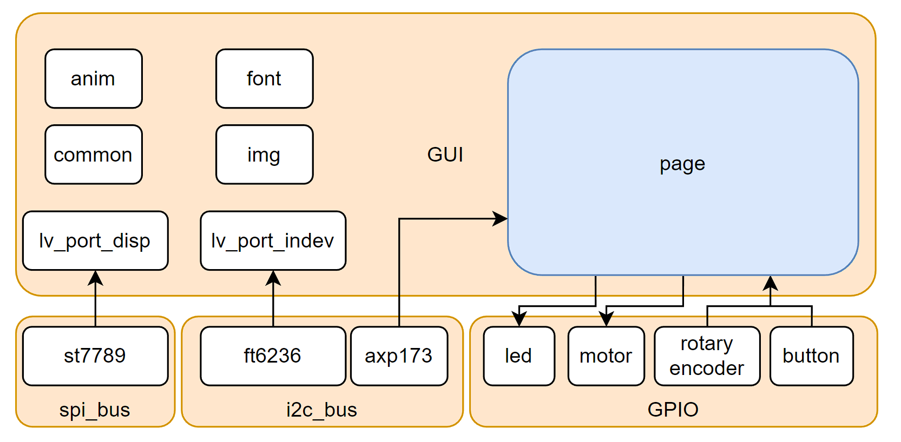

# exS3-Software

exS3的软件仓库，已根据个人喜好对第三方组件进行裁剪修改

 - **ESP-IDF 4.4.4**
 - **LVGL 8.3.1**

*****

## 开发日志

> - [2022.10.23]之前：移植lvgl8.2，编写AXP173驱动，添加动画等，更改开发日志格式
> - [2022.10.23] 使用新UI
> - [2022.10.25] 尝试移植Encoder外设组件，但lvgl似乎不能同时支持触屏和Encoder，遂放弃此功能
> - [2022.10.27] 修改axp173驱动组件
> - [2022.10.28] 修改、完善GUI info_page页面信息
> - [2022.10.29] 整理代码
> - [2022.10.31] 添加axp173中断功能，未做测试
> - [2022.11.05] 添加wifi和sntp，但wifi报flag=9错误，先备份
> - [2022.11.05] 修改屏幕驱动，梳理程序框架和启动流程
> - [2022.11.06] 添加马达震动反馈
> - [2022.11.07] 添加nvs文件，整理storage组件
> - [2022.11.07] 添加当前工程Kconfig文件，暂未在具体文件中inlcude
> - [2022.11.08] 添加encoder调节LCD背光功能,减缓“烧屏”现象
> - [2022.11.10] 将原来encoder_button组件独立出来，后续将支持多按键
> - [2022.11.10] 添加息屏led闪烁指示、code format、修复息屏能触摸操作的bug
> - [2023.03.22] 重构，移除wifi和储存组件，软件结构更加清晰
> - [2023.03.23] 修复axp173不能长按关机的问题，添加注释，define替代enum
> - [2023.03.26] encoder task里接受queue设置了200ms延时，导致短按唤醒屏幕失灵，已修复
> - [2023.04.02] 修改wifi和sntp，已实现联网获取sntp时间

